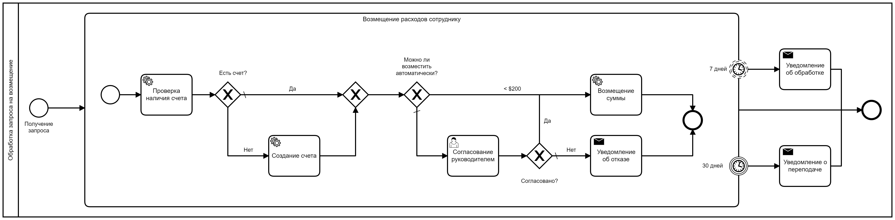
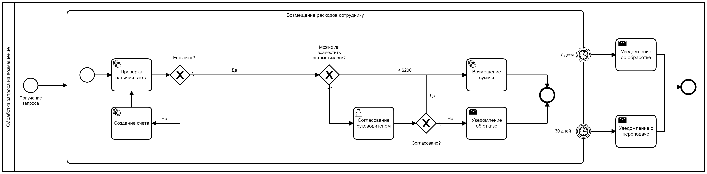

# Процесс по возмещению расходов сотруднику





### 1 Процесс
Придерживаясь идеологии camunda, для быстродействия в процесс лучше всего не тащить всю доменную модель, а ограничиться 
теми данными, которые понадодятся в самом процессе для роутинга. Каждый delegate сможет вытащить доменную модель из БД и 
по businessKey и дальше проводить с ней манипуляции, если это нужно

Плюсы такого подхода:
- более быстрая работа системы, 
- меньшая объем исторической бд камунды, 
- меньшая связанность системы в целом
- возможность перехода / работы на микросервисах

Опять же, надо исходить из задачи, иногда, возможно поместить доменную модель в переменые процесса.

Следующий важный момент - обработка ошибок и мониторинг.
- Если предполагается работы через Cockpit, а камунда в новых версиях (особенно Enterprise) сделала его очень удобным и функциональным,
я бы поредложил пробрасывать инцеденты в процесс, для этого достаточно будет кинуть RuntimeException, либо вызвать соотвествующие методы в processEngine
- В ином случае, будет удобно использовать внешние сразства, отправку email, например, 
Что касается бизнесовых ошибок и их обработки - boundaryEvents + логика обработки

По опыту можно и дорожки использовать, для разграничения ролей, напрмер, но тут, на мой взгляд, нужно отталкиваться от читаемости и наглядности

### 2 Интерфейс и зависимости процесса
В MVP реализации нам на вход будет достаточно получить 
```
String userId
String userEmail
Double sum
String purpose
```
Дальше проверим наличия счета, если он есть - получим его номер и запишем в переменные процесса
Если его нет - пойдем в сервис и создаим счет, подразумеваем, что нам в ответ вернется номер счета, если же нет, то после создания вернемся в проверку

Дальше ветвим процесс по запрашиваемой сумме, если можем, сразу возмещаем
Если нет, создаем userTask на руководителя, после ждем ответ

Согласовал - возмещаем
Нет - уведомляем пользоватлея

Все эти действия происходят в подпроцессе с boundaryTimer
При сумарном сроке 7 дней - информируем о том, что нужно еще подождать
При 30 сроке - завершаем процесс, информируем


### 3 Модель процесса
Здесь лучше использовать примитивы, с которыми уже умеет работать камунда, в целом есть возможность работы с любыми объектами,
но стоит помить, что тогда нужно быть предельно внимательными с serelizationId, так как его изменение может сломать работу

Исходя из этих сображений в модель процесса поместим следующие данные
**Модель данных процесса**
```
String userId // id пользователя (по нему ходим в сервис рабты со счетами)
String userEmail // Email пользователя (для уведомлений, но может быть и id, (обычно можно))
Boolean approve // Признак согласования рукводителем
String account // Аккаунт пользователя, null - если его нет
Double sum // Сумма возмещения
Date followUpDate //Автоматически рассчитваемая дата конца действия задачи руководителя
```
Этого набора будет достаточно для осуществелния маршрутизации нашего процесса

**Модель данных**
Тут стоит подумать, кто будет пользователем нашей системы и какие будут участвовать смежные системы
Пользователи: Сотрудник, Руководитель
Системы: Работы со счетами и начислениями, нотификации

Давайте отолкнемся от того, что нужно руководителю для согласования:
- Расшифровка затрат / обоснование
- Чеки или квитанции
- Можно предположить, что за раз сотрудник может подавать не один документ, но тут появляется возможность частичного согласования, что нужно будет учетсь в процессе. (approvedSum)
- Комментарий руководителя на случай отказа. Для пользователя будет важно понять почему
Тут в целом нужно сходить к руководителю и опросить его на предмет, что еще ему нужно для принятия решения
Так же можем предполоить, что у нас есть стурктура, а значит нужно добавить в модель принадлежность к стуктурной единице
- стуктурная единица
Учтем это, нужно реализовать логику назначения userTask

Нотификация:
В постановке мы хотим отправлять на почту информацию, тут по хорошему бы пользователя информировать не только об отказах, но еще и об зачислении
А так же иметь возможность быстро перейти на другой тип уведомлений, почта - это скучно, вот телеграм или смс куда интересней
Скорее всего в инфраструктуре уже есть какой-нибуль сервис для нотифкация
- Дадим пользователю выбрать тип получаемых уведомлений

Работы со счетами:
- Очень опционально сумма счета после пополнения (вдруг пользователям важно это?)

Аудит
У нас система, которая работает с деньгами, важно фиксировать информацию, кто и что делал, когда.
Много информации будет содержаться в бд камунды, так же система работы с счетами должна фиксировать факт создания счета и начисления на него денег
Мы со своей стороны можем
- Сохранять в бд кто согласовал или зареджектил начисление и когда
- Фиксировать временные метрики, вдруг потом окажется что скорость реакции руководителя будет влиять на KPI )

**Вот так, например, может выглядеть модель**
```
{
  String userId,
  Date createDate,
  String userEmail,
  String phone,
  Enum notificationType,
  Double sum,
  String account,
  details : [
    {
      Double sum,
      String desc,
      files : [ ],
      Boolean approved,
      Double approvedSum,
    }
  ]
  String chiefId,
  String chiefComment,
  Boolean approve,
  Double approvedSum,
  Date refundDate
}
```
При этом важно не преврарить легкий сервис в монстра, с тяжелым ыункционалом, можно придумать сюда же процесс возврата заявления, 
фиксацию стадий, админку для пользователя с отслеживанием кто и работает над его заявлением )) И в итоге получить систему подобную ГосУслугам ))

#### Модель данных ближайщих систем
**Система начисления денег и работы со считами**
На мой взгляд - это одна и та же система должна быть
Для создания аккаунта срокей всего потребуется не только id пользоватяля (подтянуть данные из бухгалтерии?) нужно ли?
